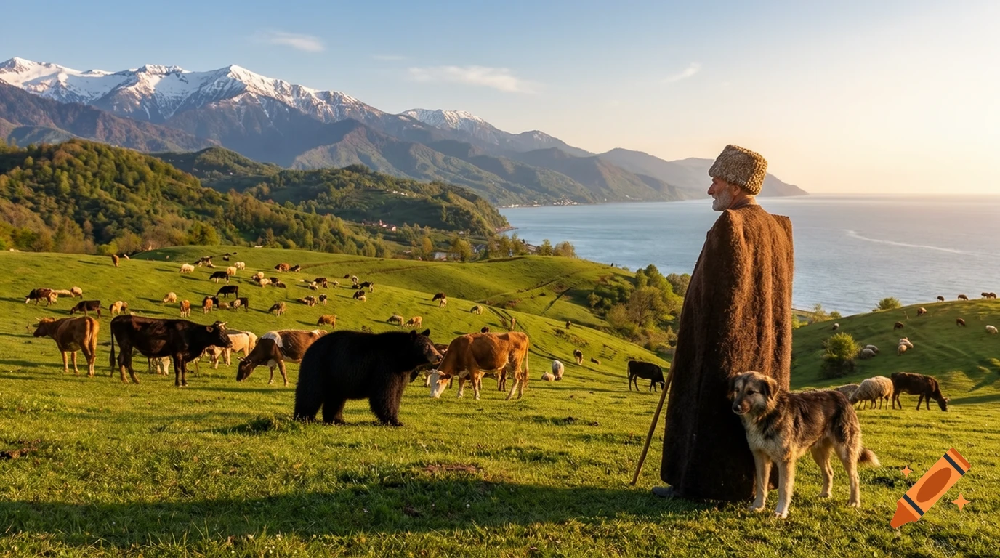
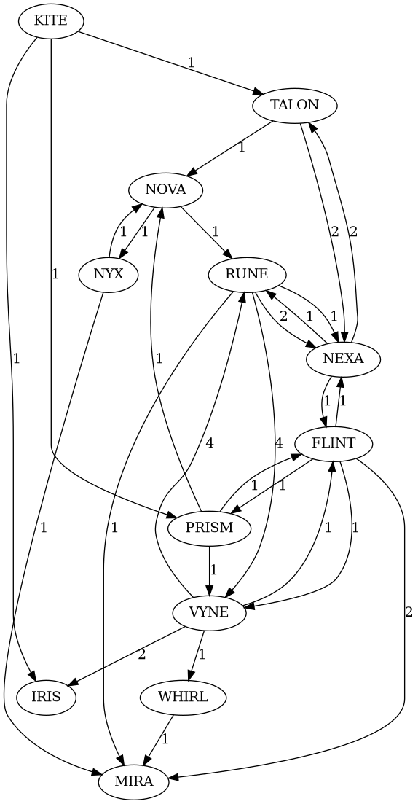

# Task 1 – AI Generated Image

The edited image with the added **Black Bear** is shown below.

---

# Task 2 – User Manual

## AI Tool Used
For this task I used **Craiyon**. I found the website while searching for free AI image editing tools. One advantage of Craiyon is that it can be used without creating an account or registering, making it quick and easy to start editing images.

## Steps

1. Open the Craiyon website in your web browser.
2. Select the AI image editing feature.
3. Upload the original picture downloaded from the provided link.
4. In the prompt box, enter the following instruction:

> **"Can you add a Black Bear to this picture being there?"**

5. Submit the prompt and wait for the AI to generate the edited image.
6. Review the generated results and choose the version where the black bear is naturally blended into the landscape.
7. Download the final image.

## Notes
- No registration or sign-up was required.
- The AI automatically blended the bear into the lighting and scenery.
- Only a single short prompt was needed to complete the task.

## Images to include in the report
- Screenshot of the Craiyon homepage/interface.
- Screenshot after uploading the original image.
- Screenshot showing the prompt before generation.
- The original image.
- The final edited image (shown above).

---

# Task 3 – User Manual

## Graph 

